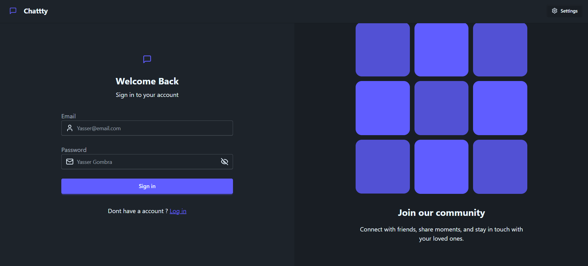
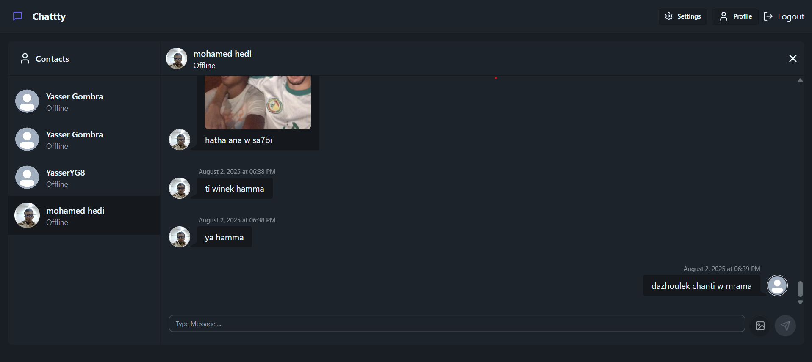

# 💬 Chatty

Chatty is a real-time chat application that allows users to communicate with each other in a smooth and modern UI. Built with React, Express, and Socket.IO, the app supports authentication, online/offline status, and responsive design.


## 🛠️ Tech Stack

### Frontend
- **React 18** + **Vite**
- **TailwindCSS**
- **Zustand** – for global state management
- **Toastify** – for notifications
- **DaisyUI** – for light/dark mode and UI components
- **Axios** – for HTTP requests

### Backend
- **Node.js** with **Express.js**
- **MongoDB** + **Mongoose**
- **Socket.IO** – for real-time communication
- **JWT** (jsonwebtoken) – for secure authentication

## 🚀 Features

- Real-time 1-on-1 chatting
- Online/offline user status indicator
- Auth system using JWT
- Toast notifications
- Responsive UI with light/dark mode toggle
- Modular architecture
- Protected routes with middleware
- Built with global state using Zustand

## 📸 Screenshots

| Login Page | Chat Window |
|------------|-------------|
|  |  |

## 📦 Installation

1. **Clone the repository:**

```bash
git clone https://github.com/yourusername/chatty.git
cd chatty
